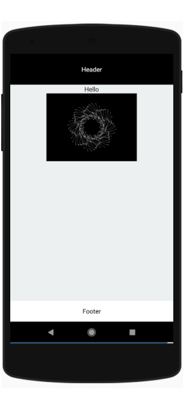

# Exo-4

# Objectives

Create a small app in react native that looks like this

Before starting this exercise do this to get familiar with flex boxes with this : https://flexboxfroggy.com/

# What to use

You will first need to create a new react native app :

https://facebook.github.io/react-native/docs/getting-started

To create this app you will need to use these new elements :

> Flex : https://facebook.github.io/react-native/docs/flexbox

> Image : https://facebook.github.io/react-native/docs/image