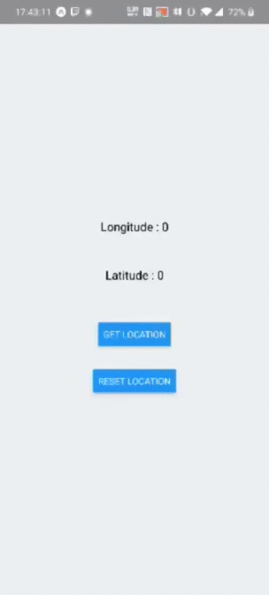

# Exo 10

# Objectives

Create a simple app with two buttons one that retrieves your location and prints your longitude anf latitude and the other that resets it

# What to use 

You will first need to create a new react native app :

https://facebook.github.io/react-native/docs/getting-started

To create this app you will need to use this new element :

> Permissions : https://docs.expo.io/versions/latest/sdk/permissions/