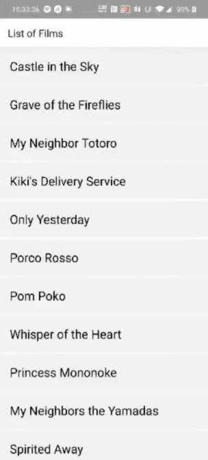

# Exo-13

# Objectives
Create an app that will use the ghibli api to get all the film. You must be able to click on a film, retrieve the data on it and print everything on the screen

# What to use

You will first need to create a new react native app :

https://facebook.github.io/react-native/docs/getting-started

To create this app you will need to use this new element :

> Fetch : https://facebook.github.io/react-native/docs/network#using-fetch

> Api : https://ghibliapi.herokuapp.com/#section/Studio-Ghibli-API