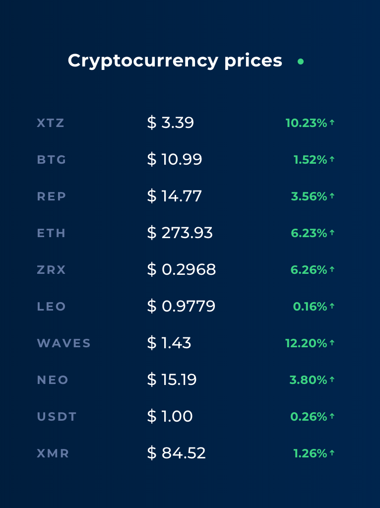

# Exo-14

# Objectives

Create an app that will use the Coinranking API and refresh it every X seconds that will be configurable

# What to use

You will first need to create a new react native app :

https://facebook.github.io/react-native/docs/getting-started

To create this app you will need to use this new element :

> Coinranking API : https://docs.coinranking.com/